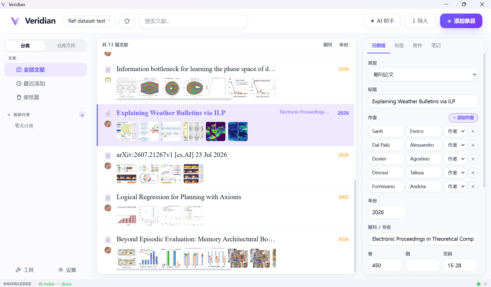
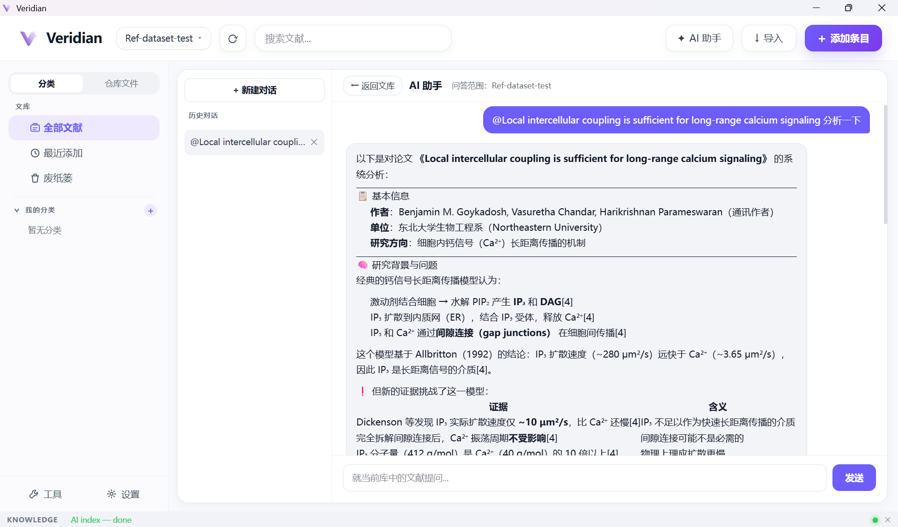

# Veridian

**A local-first reference manager with a built-in AI research assistant.**

**[English](#english)** ・ **[中文](#中文)**

---

## English

Veridian keeps your PDFs, notes, and tags organized in one library, and lets you ask an AI assistant questions about your own papers — with answers that link straight back to the source.

### Screenshots

<table>
<tr>
<td width="50%"></td>
<td width="50%"></td>
</tr>
<tr>
<td align="center">Library view — collections, metadata panel, tags, thumbnails</td>
<td align="center">AI assistant — <code>@</code>-reference a paper and ask questions with citations</td>
</tr>
</table>

### Features

- **Reference management** — Import PDFs and Veridian fills in the title, authors, journal, and year for you. Organize papers into collections and tags, write notes on each item, and search your whole library instantly. Deleted items go to Trash first, so nothing is lost by accident.
- **AI research assistant** — Ask questions in plain language and get answers with citations pointing back to the exact paper they came from.
  - Type `@` to bring a specific paper or file into the conversation as context.
  - Type `/` to tell the assistant to use one particular skill for that question; otherwise it decides on its own when a skill is useful.
  - **Skill marketplace** — Install ready-made "skills" (extra know-how for the assistant) from a GitHub link or a zip file, and manage them from Settings. A skill only adds instructions for the assistant to follow — it can never run anything on your computer.
- **Browser extension** — While reading a paper online, click the extension icon to save it straight into your library with the details already filled in.
- **Synced workspaces** — Keep a library as a folder on your computer, or connect it to a GitHub repository so it stays backed up, syncs across machines, and can be shared with collaborators.
- **PDF to Markdown, powered by MinerU** — Convert a PDF into clean, readable text (including tables and figures) using the [MinerU](https://mineru.net) API, so it's easy to search and the AI assistant can read through it. Requires your own free MinerU API key, entered once in Settings → Tools.
- **Everything stays on your computer** — Your library lives locally; nothing is uploaded anywhere unless you turn on GitHub sync or connect an AI provider yourself.
- **Chinese / English interface** — Switch the app's display language anytime from Settings.
- **Automatic updates** — When a new version is released, Veridian finds it, downloads it in the background, and asks if you'd like to install it — no manual download needed.

### Getting started: a first-time walkthrough

1. **Create or open a library.** On first launch, create a library — either a plain folder on your computer, or a GitHub repository if you'd like it synced and backed up.
2. **Add your first papers.** Click **"+ Add Item"** to import a PDF from your computer, or install the [browser extension](#the-browser-extension) and click it while reading a paper online to save it with one click.
3. **Organize as you go.** Create collections in the sidebar to group related papers, attach tags, and write notes under each item's **Notes** tab.
4. **Ask the AI assistant.** Open **"AI Assistant"**, and ask something like *"summarize what these three papers agree on"*. Type `@` and start typing a title to point the question at one specific paper.
5. **Install a skill (optional).** In **Settings → Skills**, install a skill useful for your field — it becomes something the assistant can use automatically, or you can force it for one message by typing `/` first.
6. **Turn on sync (optional).** In **Settings → Workspace**, connect a GitHub repository if you want your library backed up, available on another computer, or shared with collaborators.
7. **Stay up to date.** Just keep using the app — new versions download themselves in the background, and you'll only see a prompt when one is ready to install.

### The browser extension

Download the latest installer from the [Releases](../../releases) page. The Chrome extension is loaded separately: open `chrome://extensions`, turn on **Developer mode**, choose **"Load unpacked"**, and select the [`browser-extension/`](browser-extension) folder.

---

## 中文

Veridian 把你的 PDF、笔记和标签整理进一个统一的文献库，并让你可以直接向 AI 助手提问——得到的回答会附带指向原文出处的引用来源。

### 界面截图

<table>
<tr>
<td width="50%"></td>
<td width="50%"></td>
</tr>
<tr>
<td align="center">文献库视图 — 分类、元数据面板、标签、缩略图</td>
<td align="center">AI 助手 — 用 <code>@</code> 引用一篇论文并获得带引用来源的回答</td>
</tr>
</table>

### 主要功能

- **文献管理** — 导入 PDF 后，标题、作者、期刊、年份会自动帮你填好。可以用分类和标签整理文献，给每篇文献写笔记，随时对整个文献库进行搜索。删除的条目会先进入回收站，不会误删丢失。
- **AI 研究助手** — 用日常语言提问，得到的回答会附带指向原文出处的引用来源。
  - 输入 `@` 可以把某篇具体文献或某个文件带入当前对话作为参考内容。
  - 输入 `/`（消息开头）可以指定这一轮回答必须使用某个技能；不指定的话，AI 会自己判断什么时候需要用到某个技能。
  - **Skill 市场** — 可以从一个 GitHub 链接或本地 zip 文件安装现成的"技能包"（给 AI 助手补充的专门知识），在设置里统一管理。技能只会给 AI 助手增加行动指令，不会在你的电脑上执行任何操作。
- **浏览器扩展** — 在网页上看到一篇文献时，点一下扩展图标就能把它连同各项信息一起保存进文献库。
- **同步工作区** — 文献库既可以只是电脑上的一个文件夹，也可以连接到 GitHub 仓库，实现自动备份、跨设备同步，以及和协作者共享。
- **PDF 转 Markdown，由 MinerU 提供支持** — 通过 [MinerU](https://mineru.net) API 把 PDF（包括表格、图片）转换成清晰、易读、方便检索的文本，AI 助手也能读懂并引用。需要在 设置 → 工具 中填入一次你自己的免费 MinerU API Key。
- **数据留在你自己电脑上** — 文献库数据保存在本地，除非你主动开启 GitHub 同步或自己配置了 AI 服务，否则不会上传到任何地方。
- **中英文界面切换** — 随时可以在设置里切换整个应用的显示语言。
- **自动更新** — 有新版本发布时，Veridian 会自动发现、在后台下载好，然后询问你是否要安装——不需要手动下载。

### 新手上手指南

1. **新建或打开一个文献库。** 首次启动时新建一个文献库——可以是电脑上的一个普通文件夹，如果想要自动备份和同步，也可以选择一个 GitHub 仓库。
2. **添加第一批文献。** 点击 **"+ 添加条目"** 从电脑导入 PDF；或者装上[浏览器扩展](#浏览器扩展)，看文献时点一下就能一键保存。
3. **边用边整理。** 在左侧新建分类把相关文献归到一起，给文献打标签，在每个条目的"笔记"标签页里记点东西。
4. **向 AI 助手提问。** 打开 **"AI 助手"**，问一句"总结一下这三篇论文的共同结论"；如果只想针对某一篇提问，输入 `@` 然后打出标题选中它。
5. **安装一个技能（可选）。** 在 **设置 → Skill** 里安装一个适合你研究方向的技能，之后 AI 会自动判断合适的时候用上它，也可以在某条消息开头输入 `/` 强制这一轮使用它。
6. **开启同步（可选）。** 在 **设置 → 工作区** 里连接一个 GitHub 仓库，让文献库自动备份、可以在别的电脑上打开，或者和协作者共享。
7. **保持最新版本。** 正常使用就行——新版本会在后台自动下载好，只有等它准备就绪时才会弹窗询问你是否安装。

### 浏览器扩展

从 [Releases](../../releases) 页面下载最新安装包。浏览器扩展需要单独加载：打开 Chrome 的 `chrome://extensions` 页面，开启"开发者模式"，点击"加载已解压的扩展程序"，选择 [`browser-extension/`](browser-extension) 目录即可。
